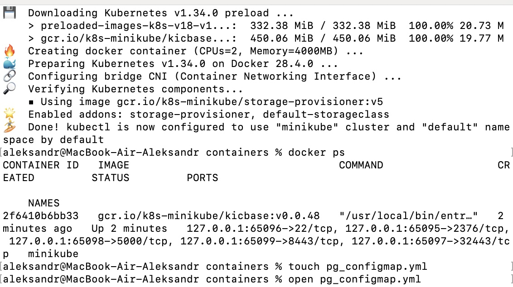
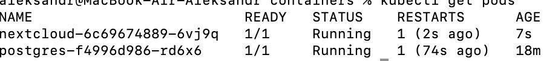
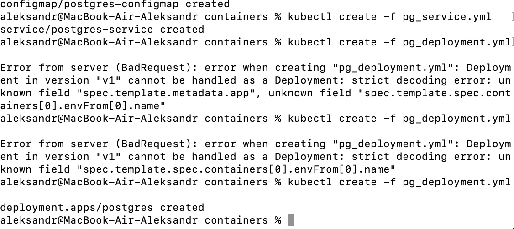
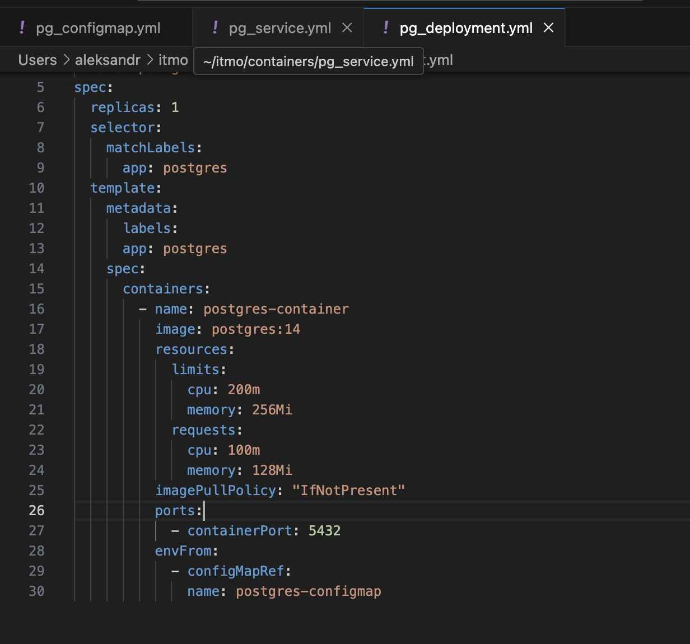
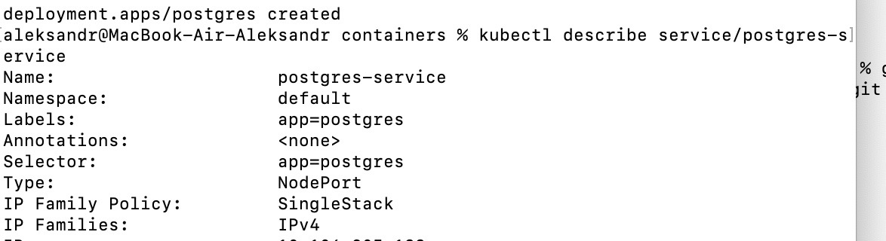

Ответы на вопросы:

1.  Важен ли порядок выполнения манифестов?
Важен, deployment ожидает уже подготовленные конфиг мепы и секреты

2. Что произойдёт при скейле postgres 0→1?
Приложение потеряет соединение с БД, будет запущен новый под под БД. При использовании PersistentVolume смонтируются те же данные, иначе  создается пустая БД

Артефакты с работы:

