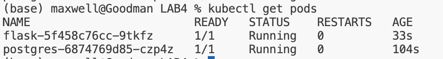
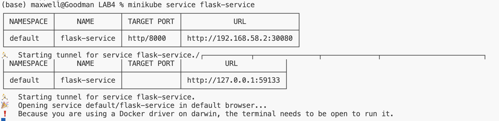
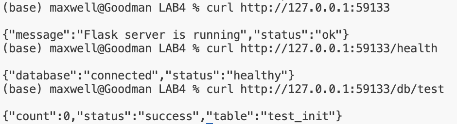

## Инструкция по запуску Lab4 в Minikube

- Официальная установка Minikube: https://minikube.sigs.k8s.io/docs/start/?arch=%2Fmacos%2Fx86-64%2Fstable%2Fbinary+download

### Выполнено
- Два Deployment: `flask_deployment.yml` (приложение) и `pg_deployment.yml` (БД); лейблы `app`, `component`.

- Кастомный образ `my_flask_image` из локального `Dockerfile` (см. шаг сборки ниже).

- Init-контейнер во `flask_deployment.yml` ждёт Postgres и создаёт таблицу; основной контейнер с liveness/readiness HTTP пробами.

- Volume в деплойменте Postgres через PVC `db-data`; сервисы `flask-service` (NodePort 30080) и `postgres-service`.

- Secret `postgres-secret` используется в обоих деплойментах (требование ConfigMap/Secret выполнено).## Инструкция по запуску Lab4 в Minikube

- Официальная инструкция по установке Minikube: https://minikube.sigs.k8s.io/docs/start/?arch=%2Fmacos%2Fx86-64%2Fstable%2Fbinary+download

### Выполнено

Два Deployment: flask_deployment.yml (приложение) и pg_deployment.yml (БД); оба размечены лейблами app, component.
Кастомный образ для приложения: my_flask_image из локального Dockerfile; сборка описана в RADME.md.
Init-контейнер присутствует во flask_deployment.yml, ждёт Postgres и создаёт таблицу; основной контейнер имеет liveness/readiness HTTP пробы.
Volume есть в деплойменте Postgres через PVC db-data; сервисы flask-service (NodePort 30080) и postgres-service настроены.
Secret postgres-secret используется в обоих деплойментах; требование ConfigMap/Secret выполнено (ConfigMap не нужен).

### 0. Запуск Minikube
```bash
minikube start
```

### 1. Подготовка Docker-образа

```bash
eval $(minikube docker-env)

docker build -t my_flask_image:latest .
```

### 2. Применение манифестов

```bash
kubectl apply -f pg_secret.yml
kubectl apply -f pg_pvc.yml
kubectl apply -f pg_deployment.yml
kubectl apply -f pg_service.yml

kubectl wait --for=condition=ready pod -l app=lab4,component=db --timeout=120s

kubectl apply -f flask_deployment.yml
kubectl apply -f flask_service.yml
```

### 3. Проверка статуса подов

```bash
kubectl get pods
```



### 4. Запуск приложения

```bash
minikube service flask-service
```



### 5. Проверка эндпоинтов

```bash
curl http://127.0.0.1:59133
curl http://127.0.0.1:59133/health
curl http://127.0.0.1:59133/db/test
```



### 0. Запуск Minikube
```bash
minikube start
```

### 1. Подготовка Docker-образа

```bash
eval $(minikube docker-env)

docker build -t my_flask_image:latest .
```

### 2. Применение манифестов

```bash
kubectl apply -f pg_secret.yml
kubectl apply -f pg_pvc.yml
kubectl apply -f pg_deployment.yml
kubectl apply -f pg_service.yml

kubectl wait --for=condition=ready pod -l app=lab4,component=db --timeout=120s

kubectl apply -f flask_deployment.yml
kubectl apply -f flask_service.yml
```

### 3. Проверка статуса подов

```bash
kubectl get pods
```


### 4. Запуск приложения

```bash
minikube service flask-service
```


### 5. Проверка эндпоинтов

```bash
curl http://127.0.0.1:59133
curl http://127.0.0.1:59133/health
curl http://127.0.0.1:59133/db/test
```

